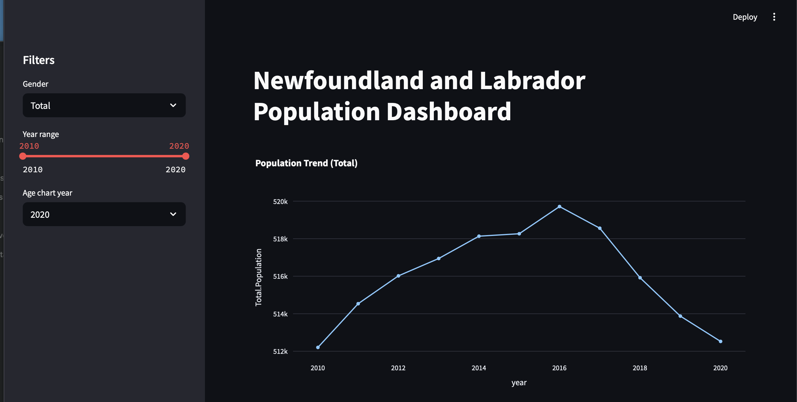
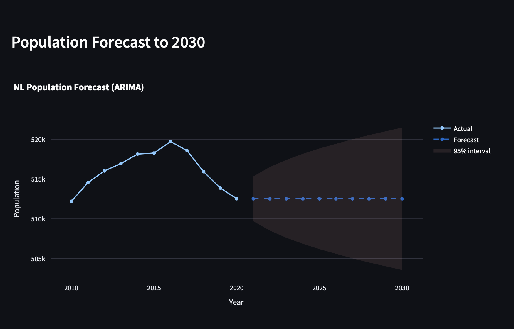
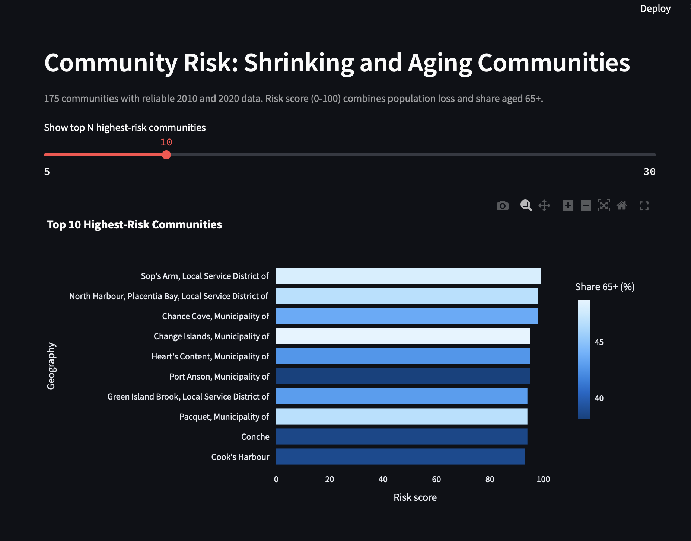

# NL Open Data Dashboard

Interactive dashboard analyzing Newfoundland and Labrador population trends, aging, and community-level risk, built on Government of NL open data.

**Live demo:** https://nl-open-data-dashboard-9zmjyxdu72gbubjfdgqhju.streamlit.app

## Screenshots

## What it does
- Population trend 2010-2020 with gender and year filters
- Population by age group and population pyramid
- ARIMA forecast to 2030 with a 95% interval
- Share of population aged 65+ over time
- Community risk ranking: which communities are shrinking and aging fastest

## Key findings
- Provincial population peaked in 2016 (519,715) and fell to 512,525 by 2020.
- Of 175 communities with reliable data, 127 (73%) lost population between 2010 and 2020 and 41 grew.
- The highest-risk communities include Sop's Arm, Chance Cove and North Harbour (Placentia Bay).

## Data
Population Estimates, Government of NL Open Data portal (opendata.gov.nl.ca).

## Method
1. Loaded and checked the raw file (13,821 rows, missing values by column).
2. Used province-level rows for trends and the forecast (complete data).
3. For communities, kept 175 of 367 with valid 2010 and 2020 values, and removed rows where 2010 population was 0 (likely missing data).
4. Risk score (0-100) = average of population-loss rank and share-aged-65+ rank.

## Limitations
- The ARIMA forecast uses only 11 yearly points, so treat it as a simple baseline.
- The risk score is a relative ranking, not a measured probability.
- Many small communities have missing values and are excluded.

## Tech stack
Python, Pandas, Plotly, Streamlit, statsmodels

## Run locally
pip install -r requirements.txt
streamlit run app.py
